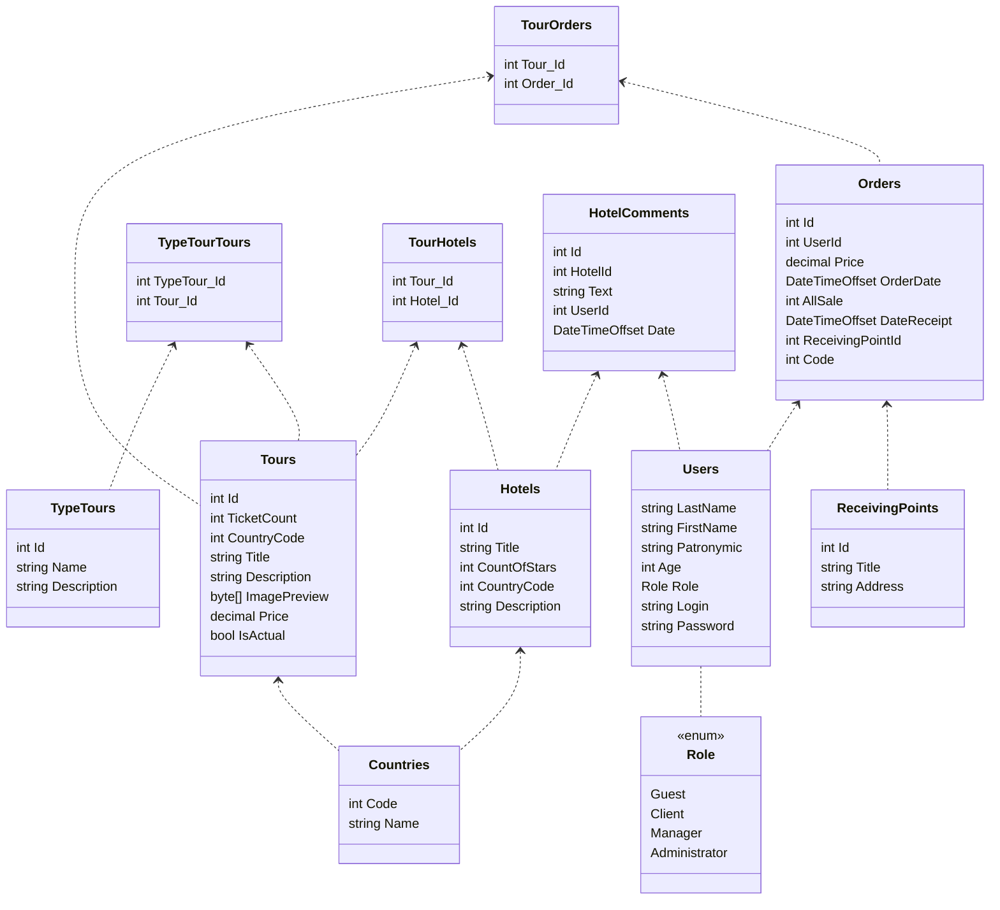

---
Задание
---

"Туры"

---
Автор
---

Конев Ефим Викторович студент группы ИП 20-3

---
Схема моделей
---

```mermaid
    classDiagram
    TourOrders <.. Tours
    TourOrders <.. Orders
    Tours <.. Countries
    TypeTourTours <.. TypeTours
    TypeTourTours <.. Tours
    Orders <.. Users
    Hotels <.. Countries
    TourHotels <.. Tours
    TourHotels <.. Hotels
    HotelComments <.. Hotels
    HotelComments <.. Users
    Orders <.. ReceivingPoints
    Users .. Role
   
    class Users {
        string LastName
        string FirstName
        string Patronymic
        int Age
        Role Role
        string Login
        string Password
    }
    class Countries {
        int Code
        string Name
    }
    class HotelComments {
        int Id
        int HotelId
        string Text
        int UserId
        DateTimeOffset Date
    }
    class Hotels {
        int Id
        string Title
        int CountOfStars
        int CountryCode
        string Description
    }
    class TypeTours {
        int Id
        string Name
        string Description
    }
    class ReceivingPoints {
        int Id
        string Title
        string Address
    }
    class Orders {
        int Id
        int UserId
        decimal Price
        DateTimeOffset OrderDate
        int AllSale
        DateTimeOffset DateReceipt
        int ReceivingPointId
        int Code
    }
    class Tours {
        int Id
        int TicketCount
        int CountryCode
        string Title
        string Description
        byte[] ImagePreview
        decimal Price
        bool IsActual
    }
    class TourOrders {
        int Tour_Id
        int Order_Id        
    }
    class TourHotels {
        int Tour_Id
        int Hotel_Id        
    }
    class TypeTourTours {
        int TypeTour_Id
        int Tour_Id        
    }
    class Role {
        <<enum>>
        Guest
        Client
        Manager
        Administrator
    }
```
